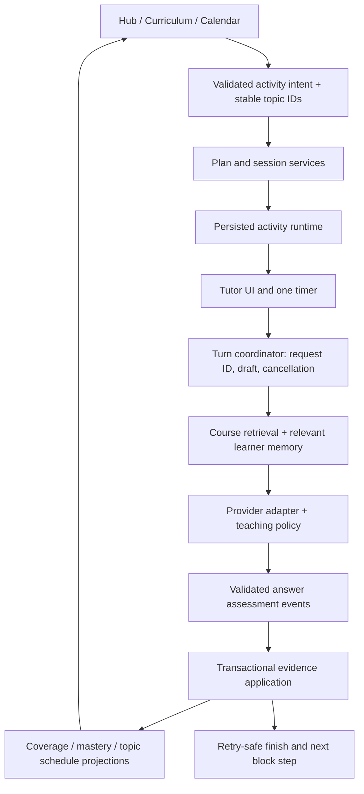

# Neuron tutor improvement plan for GPT-6 Sol

Prepared 26 September 2026. Companion: [deep audit](neuron-tutor-deep-audit.md). Execution prompt: [Sol handoff](neuron-tutor-sol-handoff.md).

## Outcome

Build a tutor that reliably teaches the chosen material, adapts to demonstrated understanding, records defensible learning evidence, and connects curriculum, review due, cards and study blocks without losing the learner's place. Success is better independent understanding and reliable recovery—not longer conversations, more generated cards, or more green completion badges.

**GPT-6 Sol is the implementation agent. This plan does not require changing Neuron's configured AI model/provider.** Keep provider choice and local AI support.

## Execution rules and baseline

1. Read the audit and current source before editing. The audit is against HEAD `b7d6a0c` plus pre-existing uncommitted changes, version 4.16.3. Several earlier Luna-plan improvements already exist locally. Reconcile with `docs/neuron-luna-improvement-plan.md`; do not undo its review-outcome, readiness, graph, test-profile, or performance fixes.
2. Preserve user changes. Use a `codex/` branch or an isolated checkout that explicitly includes the relevant working changes. Do not assume a fresh HEAD worktree contains this audited version. Record the starting diff, then commit only work owned by this implementation.
3. Keep Electron, React, TypeScript, SQLite, Zustand, existing math/Markdown rendering, and FSRS. Do not replace the learning stack, add a cloud backend, or redesign unrelated screens. Extract services as each behavior changes; avoid a wholesale rewrite of the 3,083-line IPC handler and 2,370-line session component in one commit.
4. Use additive, versioned migrations. Preserve transcripts, cards, schedules and original legacy evidence. Never infer historical correctness from a completion tick. Do not retune FSRS on unreliable data.
5. Run app tests with a unique `NEURON_TEST_USER_DATA_DIR`. No real study database, real credentials, installed-app replacement, release publication, or paid provider calls in CI. Provider evaluations are an explicit, bounded fixture run with the configured test account; never silently send real course material.
6. Complete each package with a short record of changes, tests, residual risks and next package. If parallel agents are used, share contracts first and give disjoint file ownership; the tutor handler/types/database are shared integration boundaries.
7. Current checks: typecheck and compile passed; focused tutor/curriculum/block tests passed 14 suites/66 tests. These are the starting baseline, not proof the audited behaviors are correct. Full Electron launch did not reach a first window in this audit. Repair or diagnose that test harness before claiming E2E coverage.

## Product contract

### Teaching modes

Expose four understandable intentions while retaining advanced controls:

| Visible mode | Existing paths it covers | Required behavior |
|---|---|---|
| Learn | New content, syllabus, selected material | Brief objective; explain/model for novices; guided practice; fade help; optional independent check |
| Practise | Fill gaps, active recall, selected problem | Diagnose a specific gap; one question at a time; graded hint ladder; feedback and transfer check |
| Review | Maintenance due, Quick Review | Retrieve before showing answers; bounded topic queue; record initial recall separately from help; revisit errors appropriately |
| Ask | General Chat, custom explanation | Answer the learner's question directly; optionally offer practice; no automatic assessment or mastery credit |

Custom topic is a target, not a fifth pedagogical mode. Quick Review means a quick sample with explicit coverage, not a guarantee of full mastery of every topic. Retain the user's ability to select exact materials, topics, duration, manual challenge level, and “new to this.” Separate challenge from explanation detail.

### Learning evidence and scheduling

- `selected`, `introduced`, `attempted`, `assessed`, `covered`, and `mastered` are different facts. Time spent alone proves none of the latter states.
- A valid assessment has a canonical topic ID, an actual learner answer message, a question/rubric, source context where applicable, assistance level, correctness, and assessment provenance. An LLM may propose an assessment; the application validates its references and allowed outcomes before applying it.
- No evidence, evaluator error, invalid JSON, ambiguous scope, or unfinished response means **unassessed**, not Good and not incorrect.
- For an eligible unaided recall attempt, incorrect or partial → Again; independently correct → Good. Hard requires fully correct but difficult recall, preferably explicit learner feedback. Easy requires an explicit fully correct/easy signal; never infer it from generic praise. Align this policy with the existing shared card-review outcome work.
- A hint request before any genuine attempt is assisted instruction and does not manufacture a failed review. “I don't know” in response to a valid review question is a failed retrieval. Answers produced after hints/examples are recorded as assisted practice; they cannot erase the initial retrieval outcome. A separate later unaided question can establish new evidence.
- Apply **at most one topic scheduling update per session/topic review group** initially. Keep every answer event, aggregate eligible initial recall conservatively (any failure/partial in that group → Again, otherwise Good unless a stricter explicit rating applies), and do not multiply FSRS repetitions for each scaffold turn. Make aggregation a versioned policy with tests. This is a conservative product default to validate, not a scientifically calibrated topic-level model.
- Curriculum completion means covered; mastery is evidence-backed and uncertain; retention is a model estimate. A newly saved review may yield mathematical R(0)=1; the UI must not translate this into guaranteed knowledge. Show next due date and assessment outcome instead.

### Reliable lifecycle

- Sending, saving, evaluating, finishing and advancing are explicit states. Never celebrate a durable write that failed.
- One session configuration survives restart, including mode, IDs, source versions, difficulty, goal, selected topics and review position. URLs carry identity, not the only copy of state.
- One runtime owns timer/pause/extension for an activity whether standalone or inside a study block. Persist accumulated active milliseconds and the latest active-start timestamp. On app restart or system sleep, preserve accumulated time and offer resume; do not count an overnight absence as study or silently reset a full timer. Avoid conflating window blur with a break.
- Expiry is a prompt to choose finish/extend/pause, not evidence of learning. Stop/skip/partial completion remain valid outcomes.

## Target architecture

Use these service boundaries, not necessarily these exact filenames if the repository already has an appropriate module. SQLite and the main process remain authoritative; renderer state is a view/cache.

### Additive data/contracts

| Contract | Minimum fields and invariants |
|---|---|
| Session config/runtime | schemaVersion, sessionId, explicit conversationId, userId, subjectId nullable only for general chat, mode, targetTopicIds, material/version IDs, goal, difficulty/scaffold preferences, queue/cursor, duration, activeElapsedMs, activeStartedAt, pausedAt, lifecycle, revision |
| Tutor turn | turnId/requestId, sessionId, userMessageId, assistantMessageId, status queued/streaming/complete/cancelled/failed, attempts, provider/model/prompt version, terminal reason; unique accepted user turn |
| Question and assessment | questionId, topicId, rubric/source references, answerMessageId, correctness correct/partial/incorrect/unassessed, help level, evidence excerpt/reference, assessment status/version; empty or contradictory evidence rejected |
| Topic review group/events | stable groupId=session/topic independent of policy version, contributing event IDs, effective rating or no-update, prior/post scheduling state, original occurredAt and deterministic sequence, policy version metadata, application status; unique group application across upgrades; immutable correction events supersede rather than erase |
| Session finalization | operationId, requestedAt, sealed transcript/evidence revision, transcriptSaved, evaluation pending/running/applied/failed/unassessed, outcome partial/completed/abandoned, result; retries return persisted status; stale worker revisions rejected |
| Study block/step | blockId, stepId, planVersion, activity kind/payload, topic/resource IDs, linked activitySessionId, ordinal, budget, pending/active/paused/completed/skipped/abandoned, completion operation ID |
| Source reference | materialId, contentHash/version, chunkId, section/page/character offsets when available, excerpt; never invent a page number not preserved by parsing |

Validate ownership via session → user/subject → module/topic joins on every mutation. Do not trust renderer-supplied IDs, titles or AI-selected IDs. A general chat has a genuine nullable class context; it must not borrow an arbitrary first class for storage or card saving.

## Ordered work packages

### S00 — Establish reproducible evidence and isolated fixtures

**Dependencies:** none. **Findings:** all, especially coverage gaps.

- Record current Git diff and baseline checks. Diagnose Electron first-window timeout with process stderr and isolated profile; do not rebuild/install over the user's application as a workaround.
- Create seeded fixtures: no classes; novice class with materials; overdue/unknown topics; two modules with identical topic titles; long dialogue; mixed completed/pending plan; future calendar slot. Keep all content synthetic.
- Add reusable provider fixtures for streaming success, wrong/partial answer assessment, missing evidence, malformed JSON, rate limit, cancellation and stalled body. No network required.
- Add failing behavior tests for A01/A02/A06/A08/A11/A12. Tests must invoke production functions/components/IPC, not reimplement their formulas. The existing `tutorPause.test.ts` duplicates logic and is insufficient for timer integration.
- Capture renderer screenshots at 1440, 1280, 900 and the supported minimum window width, light/dark and 200% zoom. Record console errors, initial render and token-render timings as baselines; no guessed speed claims.

**Files:** `tests/setup.ts`, `tests/e2e/`, `playwright.config.ts`, `electron/main.ts` only if test isolation requires a repair; new `tests/fixtures/tutor/` and behavior tests.

**Exit:** tests use isolated profiles and synthetic provider responses; critical reproductions fail for the documented reason; existing baseline failures are distinguished from new failures.

### S01 — Stop unsupported learning credit immediately

**Dependencies:** S00. **Findings:** A01–A05, A17.

- Before broader refactoring, remove default Good for missing assessments and remove automatic inclusion of all targeted topics in learned/reviewed sets. Require valid answer evidence and exact owned topic IDs for mutation.
- Introduce the minimal question/answer/topic evidence contract now: stable question reference, learner message ID, owned topic ID, correctness and assistance. S02 persists it and S06 enriches question generation/rubrics. Unsupported legacy turns remain unassessed with that limitation visible; do not retain summary-only credit to preserve an appearance of functionality.
- Permit zero strengths/struggles and explicit insufficient evidence. Fuzzy matching can suggest a topic for review but must not mutate one.
- Stop clearing gaps merely because a topic was targeted or discussed. Keep legacy mastered stable on another positive observation until its replacement is ready.
- Remove “100% retention” success wording. Keep the transcript saved if assessment fails; display “Session saved; assessment pending” or “Not enough evidence,” with retry. Do not mark local UI as durably finished after a failed save.
- Add a short-term repeated-completion guard; S02 supplies the full concurrency-safe transaction/ledger.

**Files:** `electron/ipc/tutorHandlers.ts`, `src/pages/tutor/TutorSession.tsx`, relevant outcome types; `tests/unit/tutorMemory.test.ts`, `tutorSrsIntegration.test.ts`.

**Exit:** 20 selected topics/one assessed answer changes only that topic; two assistant messages/no learner answer changes none; failed assessment changes none; foreign IDs rejected; a lapse is never celebrated as mastery. Update old tests that encode the incorrect auto-credit behavior.

### S02 — Make assessment and finalization transactional and repeatable

**Dependencies:** S01. **Findings:** A02–A05, A16–A17, A19.

- Add versioned evidence/turn/finalization tables and indexes, plus explicit conversation linkage. Migrate the current tutor-session/conversation ID bridge without assuming IDs always match. Preserve standalone/general history and cascading deletion semantics; verify foreign keys after migration.
- Extract `tutorSessionService` and `tutorAssessmentService` from IPC. Fetch canonical transcript/turns on the backend, not renderer-supplied summaries. End requests save intent/transcript state quickly, then evaluate outside a DB transaction.
- Before sealing completion, either await the active turn or cancel it and explicitly exclude its incomplete response. Bind evaluation to a durable transcript/evidence revision; reject late results for a superseded operation/revision. Reopening starts a new revision/session under an explicit rule rather than mutating an already sealed transcript.
- Validate structured evaluations, then atomically insert/apply unique evidence and review-group events, update projections and finalization result. Persist retries and recovery jobs. Concurrent end calls must converge on one result. Do not hold SQLite transactions across model calls.
- Separate transcript saved, session closed, and assessment applied so the learner can leave after a durable checkpoint while assessment is pending. On restart, recover pending work without awarding interim credit.
- Replace free-text concept creation with canonical topic/concept mapping. Keep unresolved historic strings visible as legacy data. All BKT/CKRF/SRS projections consume the same validated event rather than separate strength/struggle guesses.
- Correct `ended_at` lifecycle semantics and return recent history chronologically. General Chat must work with zero subjects. Require a target class when saving cards from unscoped chat.
- Add an assessment correction/dispute path that appends a correction event and rebuilds affected projections from a known snapshot/event sequence. Capture baseline snapshots for legacy history; replay original occurrence timestamps, deterministic order and recorded policy versions, never the current clock. A policy upgrade cannot create a second review group or reapply an old review implicitly; do not overwrite history silently.

**Files:** `src/lib/db.ts`, `src/types/index.ts`, `electron/ipc/tutorHandlers.ts`, proposed `electron/services/tutorSessionService.ts`, `tutorAssessmentService.ts`, `tutorEvidenceService.ts`, `src/lib/memory/{ckrfMemoryService,topicSrsEngine}.ts`, IPC/preload declarations.

**Exit:** duplicate/concurrent end calls cause one scheduling repetition/group; injected mid-transaction failure rolls back all learning effects; retry succeeds once; malformed assessment retains pending/unassessed state; migrations preserve old data and `PRAGMA foreign_key_check` is clean; correcting an assessment does not duplicate unrelated evidence. Finish-during-stream, finish-while-assessment-pending and reopen/new-turn races preserve the sealed revision.

### S03 — Persist teaching intent and repair the turn lifecycle

**Dependencies:** S02. **Findings:** A06–A10, A16, A21, A26–A27.

- Replace boolean mode combinations with a validated discriminated activity/session contract, with adapters for existing entry paths. Save the whole versioned config before the first request. Explicitly pass that saved config to the opening turn; do not depend on just-set React state.
- Propagate Active Recall/Practise correctly. Preserve adaptive selection, material/topic IDs and Quick Review cursor on reload. Use a structured cursor/visited/assessed set; stop parsing Markdown headings or `[TOPIC]` markers as application state.
- Move session initialization and streaming state into a focused hook/controller. Guard route changes with request identity; reset session-specific state; prevent duplicate creation when effects overlap. Parse URL config once and validate it—`URLSearchParams` already decodes it.
- Persist user message before clearing the composer; set the in-flight guard before awaiting the save. Include each message exactly once in model history. Retain drafts on error and across route changes. Distinguish transport retry from generating a genuinely new answer.
- Every stream event carries requestId, sessionId and sequence; deliver to the requesting webContents. Ignore stale events. Main process owns final message persistence; renderer renders canonical message IDs and partial/failed states.
- Add Stop/Retry and provider cancellation registry, cleanup on sender close/navigation, abort through body consumption, first-token/idle/overall deadlines and terminal semantics. Handle SSE `[DONE]`, EOF and parse errors. Document nonstreaming adapters instead of simulating responsiveness as genuine streaming.
- Remove destructive global cleanup. Preserve technical content byte-for-byte; sanitize/render supported Markdown/diagrams through existing safe components. A completed response has one canonical representation across stream and reload.
- Fix stale closure/scroll binding, announce a new response without forcing scroll/focus if the learner is reading elsewhere. Remove blanket internet checks for local providers; use provider capability/readiness checks.

**Files:** `TutorSession.tsx`, `GeneralChat.tsx`, `ChatInput.tsx`, `ChatMessage.tsx`, proposed `src/hooks/useTutorSession.ts`, `useTutorTurn.ts`, `electron/ipc/aiHandlers.ts`, proposed `electron/services/tutorTurnService.ts`, `electron/preload.ts`, `src/types/electron.d.ts`, `src/types/index.ts`.

**Exit:** every mode survives create→reload→resume; A-session chunks cannot appear in B; retry creates no duplicate messages; abort after first token stops work and reaches a terminal state; stalled body recovers; Python indentation/math survive; IME Enter does not send prematurely; draft survives save failure. Question progress derives from question IDs, not punctuation.

### S04 — Unify study blocks, tutor runtime and completion

**Dependencies:** S02–S03. **Findings:** A11–A14, A17, A24.

- Persist blocks/steps with stable identity and linked activitySessionId. Snapshot only selected pending activities. Resume that exact session and elapsed time even if hub ordering changes.
- Implement one coordinator with start/resume/pause/extend/finish/skip/stop commands. Use router state rather than `window.location.pathname`; remove custom-event handoffs that drop transition intent.
- Use one timer/runtime for both pacing and banner, with timestamp-derived display and explicit suspend/restart policy. Persist transitions and bounded checkpoints; renderer ticks must not write the entire app store every second unnecessarily.
- All exit/Next/time-up/summary actions call the same idempotent command. Save activity state before advancing; assessment can remain durably pending and must be shown as such. A failed required save keeps the step available to retry.
- Completion, skipping, abandonment, time spent and evidence are separate. Last-step expiry gets the same extend/finish/pause choices as other steps. Offer “Next: [activity]” rather than ending the entire block.
- Recalculation versions remaining work and never deletes active step/session identity. Use optimistic revisions or equivalent to reject conflicting updates.

**Files:** `src/store/appStore.ts`, `src/lib/focusBlockNav.ts`, `FocusBlockTimerBanner.tsx`, `FocusBlockTimeUpModal.tsx`, `TutorHub.tsx`, `TutorSession.tsx`, `StudySession.tsx`, new block service/coordinator and schema/type additions.

**Exit:** real HashRouter integration verifies one finish/checkpoint then correct next activity; mixed completed/pending plans never replay old work; pause/extend agree in prompt and UI; route-away/restart/resume preserves progress; sleep does not silently consume a fresh block; early stop does not claim all steps learned; save failure cannot lose the block.

### S05 — Ground tutor answers in retrievable, inspectable sources

**Dependencies:** S03; use S02 provenance. **Findings:** A15, A19–A21, A27.

- Extract a shared main-process retrieval service from existing RAG utilities. Index and retrieve all relevant class materials, respecting explicit material selection. Reuse chunking/embeddings where sound; add a deterministic lexical fallback for unavailable embeddings/local providers. Do not assume the existing embedding search is adequate without relevance/version tests.
- Retrieve using current goal, topic, question and learner confusion. Apply subject/material ownership, token budgets, near-duplicate removal and source-version filtering. Add compact recent dialogue and topic-relevant memory; preserve goal and source constraints in a rolling summary with provenance.
- Preserve section/page metadata where parsers provide it; otherwise cite filename + excerpt/section. Source links open an inspectable excerpt and correct material. Distinguish course-grounded claims from a generated analogy/application and optional general knowledge.
- Handle contradictory documents, missing passages, stale indexes and no-material mode honestly. Treat uploaded instructions as untrusted source content. Do not claim access merely because an outline names a concept.
- Cache by material version/query/topic where useful; invalidate on replacement/deletion. Keep provider token budgets and actual usage metadata visible in diagnostics, never in the learner's main flow.

**Files:** `electron/ipc/ragHandlers.ts`, `documentParser.ts`, `tutorHandlers.ts`, `src/lib/{ragChunker,vectorSearch,embeddings}.ts`, new `electron/services/tutorContextService.ts`, source-reference schema and `ChatMessage.tsx` citation UI.

**Exit:** a fact in the middle of a long document or oldest/sixth document is retrieved and accurately cited; wrong-subject sources excluded; replaced/deleted sources cannot substantiate a new answer; unsupported answer says what is missing; uploaded prompt injection cannot change application actions; local fallback works without a remote embedding key.

### S06 — Implement a coherent teaching policy and assessment loop

**Dependencies:** S02–S03, S05. **Findings:** A04, A07–A08, A18–A19.

- Replace accumulated prompt fragments with a compact policy hierarchy: learner intent/stop → mode/goal → source limits → current teaching action → learner evidence/preferences → time budget. Version prompts and test precedence. No requirement to end every reply with a question.
- Persist scaffold state: diagnose → explain/model → guided attempt → independent check → reflect/next review. This is flexible; Ask can stay explanatory and Review begins with retrieval. Mode transitions are explicit app events validated against allowed transitions, not prose keywords such as “deep dive.”
- Offer Hint, Explain differently, Show example, Check my reasoning, Make harder/easier, and Move on. A hint ladder progresses from cue to substep to worked example; after repeated struggle offer a demonstration and a fresh question, not an endless interrogation. A requested direct answer is allowed and marked as assisted learning.
- Use one main cognitive task per turn, concise actionable feedback, and evidence-specific encouragement. Invite correction when uncertain. Handle learner frustration or ambiguity before increasing difficulty. Do not infer low ability from slow typing or a break.
- Adapt from recent topic-specific evidence and help level, with a small bounded step per assessment. Respect manual challenge choice. Warmups must be genuinely relevant prerequisites; unverified graph edges must not become hard locks.
- Generate question/rubric/source metadata before asking; persist question IDs. Validate numeric units/signs and symbolic equivalence using appropriate existing deterministic support, with structured model assessment for explanations. Do not rely on free-text summary praise as correctness.
- Independently assess long-session late answers; build summaries from the evidence ledger, not first-N characters. Allow spaced variants of prior questions; avoid immediate verbatim repetition unless requested.

**Files:** new `src/lib/tutor/teachingPolicy.ts`, `tutorPrompts.ts`, `assessmentPolicy.ts`; extracted backend context/assessment services; `src/lib/memory/ckrfMemoryService.ts`; tutor controls and setup UI.

**Exit:** deterministic controller/provider fixtures verify the application handles each teaching action and assistance label correctly; real-model runs under the S11 reviewed rubric evaluate novice explanation, expert brevity, one-task load, bounded hints, frustration repair, direct-answer and stop compliance (record provider/version and any unrun cases); skipped topics stay unassessed; an early error followed by a later independent success remains accurately represented, including after 8,000 characters/30 turns.

### S07 — Make curriculum and retention consistent and understandable

**Dependencies:** S02, S06. **Findings:** A03–A05, A22.

- Create one backend topic-status projection used by curriculum, hub, due queue and tutor summaries. Return coverage, evidence counts, mastery estimate/confidence, retention estimate or null, last assessed time, next due, and explanation separately.
- Manual “covered” is a coverage event only. “Unmark covered” changes coverage and keeps real review history. A separate explicit reset operation is required to reset learning data. Legacy manually covered topics are flagged as uncertain/calibration needed, without manufactured successful reviews.
- Align effective desired-retention settings with card scheduling or explicitly expose a distinct topic setting. Keep existing FSRS math; store policy/version on events and test schedule bounds.
- Use local calendar dates for due labels and UTC instants for elapsed time. Split due today, overdue and estimated fading; validate finite dates/stability/rating values. No-history → “Not yet assessed.”
- Preserve IDs/evidence links through curriculum regeneration. Put unmapped historical topics into an explicit previous/unmapped section rather than silently moving them to an arbitrary module. Handle rename/split/merge through an audited mapping flow.
- Gaps close only after relevant remediation/assessment criteria; covered topics can still need review. Reuse the earlier Luna graph/readiness corrections and avoid reintroducing completion-as-mastery.

**Files:** `topicSrsEngine.ts`, `tutorHandlers.ts`, `syllabusHandlers.ts`, `CurriculumView.tsx`, `CurriculumProgressBar.tsx`, `UnifiedSubjectDetail.tsx`, `TutorHub.tsx`, shared types/projection service.

**Exit:** every screen agrees on topic identity/status; manual toggles do not add/delete real reviews; unknown never appears as 100%; due labels correct at UK/local midnight and DST boundaries; changed retention setting affects expected intervals; curriculum reconciliation retains history and shows unresolved mappings.

### S08 — Build one validated planner for Review due and study blocks

**Dependencies:** S04, S07. **Findings:** A13–A14, A22–A24.

- Produce a shared candidate set from due topic reviews, due cards, unassessed/new topics, diagnosed gaps, prerequisites, upcoming deadlines and selected context. Candidate carries stable IDs, activity type, prerequisites/resources, estimated effort, reason, success criterion and evidence confidence.
- Use a deterministic allocator as the correctness layer. Validate positive finite durations, supported activity, ownership, resource availability, no duplicate/completed IDs, and sum of budgets ≤ available time. Represent leftover time as buffer; do not invent work to hit an exact sum. Permit a useful 5-minute review without forcing a 15–30-minute drill.
- The AI may propose ordering/explanations among supplied IDs; validate them and fall back to the same candidates. It cannot invent targets or silently substitute the first class. Both AI and fallback include curriculum maintenance.
- Add distinct activity payloads for review_cards, create_cards, learn_topic, retrieve_topic and read_material, with correct destinations and topic/material filters. The same review launched from curriculum, hub or block must produce the same contract.
- Generate/validate replacements before transactionally saving a new plan version. Preserve active steps; reject stale concurrent generation. Completed/abandoned work must not reappear silently.
- Let the learner adjust budget, select class/topic, defer/replace/reorder pending items, and see “Why this?” without overwhelming detail. Replan remaining work after observed progress with a visible change, not a surprise jump.
- Retain calendar-selected local date/start/timezone; distinguish Start now from Schedule. Use the selected slot's context and validate overlap/resources. Link scheduled blocks to their calendar event.

**Files:** extracted `electron/services/studyPlanService.ts`, `src/lib/studyPlanAllocator.ts`, `tutorHandlers.ts`, `calendarHandlers.ts`, `Calendar.tsx`, `TutorHub.tsx`, `focusBlockNav.ts`, plan types/schema.

**Exit:** property tests prove budget/ownership/resource invariants for 5/15/30/60/120 minutes and malformed output; AI/fallback retain same eligible review IDs; failed generation leaves old plan intact; two concurrent generations do not corrupt active work; future calendar slot stays on the selected day; post-lecture card creation opens creation with the right source.

### S09 — Simplify the full tutor interface and make it accessible

**Dependencies:** S03–S04, S06–S08. **Findings:** A05, A25–A27. Use the audit's visual matrix.

- Hub order: Resume active work → recommended study action/budget → Review due → classes. Rename “Curriculum Retention Maintenance Due” to “Review due.” Show reason, due date, approximate effort and optional estimated-retention detail; avoid red alarms for every due-today topic.
- Setup starts with goal/mode, target, time; advanced controls disclose source/challenge/scaffold settings. Display feasible scope (“Sample 4 of 18 topics in 10 minutes”) rather than promising complete mastery. Preserve all existing capabilities via explicit mappings.
- Session header shows learning objective, current topic/coverage and one timer. History becomes a drawer below 1100px; use a compact app rail in study focus layout. Ensure header controls wrap/collapse before being clipped and the composer remains visible at 900px and 200% zoom.
- Introduce shared dialog/status primitives: roles, labels, modal focus trap/restore, keyboard navigation, visible focus, Escape behavior and reduced motion. Keep message actions keyboard-reachable; label Send/Stop/attachments. Announce completed status transitions, not every streamed token.
- Keep a 65–75ch reading measure where space permits, 15–16px conversation body, tabular timer digits, and semantic color tokens. Use subtle motion/layered surfaces only if contrast and rendering performance remain sound. Preserve native local fonts and both themes.
- Batch curriculum reads, isolate per-section loading/error states and cache/invalidate on actual mutations. Do not refetch or rerender all tutor content on timer ticks. Virtualize long history only after profiling shows benefit and preserve selection/scroll behavior.

**Files:** `TutorHub.tsx`, `TutorSession.tsx`, `GeneralChat.tsx`, `TutorChatSidebar.tsx`, `SessionConfigModal.tsx`, `ChatInput.tsx`, `ChatMessage.tsx`, `src/components/common/`, `src/index.css`, `tailwind.config.js`, scoped `Sidebar.tsx`/layout changes if required.

**Exit:** keyboard-only flow covers setup→hint→source→pause→finish→next; no clipped critical controls in target viewports/zoom; actions accessible without hover; dark/light contrast measured; reduced motion respected; reading old messages is not interrupted; empty/loading/partial/offline/error states are distinguishable.

### S10 — Finish with useful summaries, cards and learner memory

**Dependencies:** S02, S05–S07, S09. **Findings:** A19–A20.

- Summary separates independently demonstrated, learned with help, still needs work, and not reached. Show saved/pending status, next due and one next action. For a block, continue the actual next step; show optional cards without blocking progress.
- Generate proposed cards from verified source-backed takeaways and specific misconceptions. Learner wrong answers are diagnostic input, never authoritative facts. Allow zero cards; remove forced quotas/15-word limits when they damage meaning. Use concise recall cards or rubric-based application tasks as appropriate.
- Keep editable approval/dedup UI, preserve topic/source/version provenance, and count actual saved cards. Quick extraction defaults to the active question's topic, not the first configured topic. Check duplicates across the selected deck.
- Make relevant tutor memory inspectable and correctable: recent difficulties, source of each observation, resolved misconceptions and preferences. Do not require a broad new memory dashboard; an expandable “What the tutor is using” panel and correction actions suffice.

**Files:** `TutorSession.tsx`, `TutorCardReviewModal.tsx`, `QuickCardModal.tsx`, `SaveCardsModal.tsx`, tutor card generation/evidence services, memory retrieval and counters.

**Exit:** a confidently wrong student sentence never becomes an approved factual card without source correction; duplicate prevention and zero-card output work; saved count matches DB; late-session evidence appears in summary; pending assessment is never disguised as success; card destination/topic remain correct.

### S11 — Evaluate quality and release in controlled stages

**Dependencies:** all preceding packages; evaluations begin earlier and repeat when prompts/policies change.

- Add a versioned synthetic behavioral evaluation set: initially 40 cases spanning quantitative STEM, biology, humanities and programming; novice/intermediate/advanced; no materials, conflicting sources, wrong/partial/correct answers, hints, direct-answer request, frustration, stop, long sessions and topic changes. Record provider/model/prompt/schema versions.
- Keep deterministic mechanics checks separate from model-quality checks. Schema validity and source-ID ownership can be automated; factual correctness, helpfulness and teaching judgment require a reviewed rubric and spot checks. An LLM judge is supplementary, not sole authority.
- Proposed release gates: zero false learning updates in adversarial fixtures; 100% pass on critical lifecycle/ownership/idempotency tests; no fabricated citation IDs; each behavioral case scores ≥3/4 for correctness/source fidelity and no critical agency/stop failure. Treat these thresholds as initial QA policy; maintain a reviewed baseline/candidate comparison and report variance across repeated runs.
- Measure first-token latency, stalled/cancelled turns, save/assessment failure rate, duplicate application count, tokens/cost per assessed topic, hints per independent success and plan completion/skip/resume rates. Do not optimize messages sent or cards generated as learning outcomes. Log metadata, not raw private course text by default.
- For actual educational improvement, compare a short unaided pre-check, immediate independent transfer check, and delayed parallel check at about 7 days (later extend to 30). Report sample sizes, difficulty and assistance; do not claim causal retention gains from internal quality scores or a small convenience pilot.
- Performance: use the S00 fixture/hardware baseline. Proposed responsiveness targets are local input feedback <100ms, no long >50ms renderer tasks during ordinary token display, and bounded history/context payloads. Measure before enforcing; keep network/model latency separate from renderer overhead.
- Run relevant unit/integration tests and typecheck after each package. At final integration run the full Jest suite, compile, isolated Electron E2E and manual keyboard/zoom/screen-reader checks. Document unrelated baseline failures without suppressing them.

**Exit:** evidence packet contains test output, fixture/model versions, before/after captures and measurements, migration/recovery proof, known limitations and rollback procedure. Do not advertise learning improvement without learner outcome evidence.

## Release and dependency sequence

| Release | Included packages | Why this boundary |
|---|---|---|
| R1: Trust and recovery | S00–S04 | Stop false credit, preserve sessions, fix completion and timers before larger behavior changes |
| R2: Teaching quality | S05–S07 | Ground answers and assessment; improve pedagogy; align curriculum and retention |
| R3: Unified experience | S08–S10 | Better planner, clearer interface, useful summaries/cards across the complete loop |
| Release qualification | S11 throughout, final gate after R3 | Compare evidence and behavior at each stage; complete end-to-end verification before release |

S05 and S04 can proceed independently after S03 if separate owners avoid shared files. S06 consumes S05 retrieval and S02 evidence. Do not put visual redesign ahead of R1 or let the UI invent state the backend cannot persist.

Use feature flags only where dual behavior is safe. Do not preserve the false-credit path as a fallback. Back up an isolated migration fixture, verify upgrades, and use forward-compatible feature disablement; do not roll back a data format by dropping evidence tables. A rollback must preserve already saved learning history.

## End-to-end acceptance journeys

| Journey | Required observable result |
|---|---|
| First-time user, zero classes, Ask | Chat starts/saves/reopens; no FK error; no accidental class/card assignment |
| Learn a new topic from selected material | Correct material and novice scaffolding in first turn and after reload; no knowledge claim before assessment |
| Twenty targets, one answer, finish early | Only eligible assessed topic changes; 19 remain unassessed; partial scope shown |
| Hint → correct answer → later independent check | Help recorded; hinted answer not Good/Easy; later independent evidence remains distinct |
| Evaluator outage/malformed output | Transcript saved; assessment pending/unknown; schedules unchanged; retry applies once |
| Stop stream, navigate, retry | Old chunks ignored; provider cancelled; draft/partial answer retained appropriately; no duplicate messages |
| Due review from three entry points | Curriculum, hub and block preserve identical topic IDs/mode/source contract |
| Block with tutor then cards | Next/expiry/finish checkpoints tutor, records plan state once, opens scoped card queue; no completed-step replay |
| Pause, extend, app restart | One authoritative time value and same session/step resume; no overnight study inflation |
| Recalculate while active; replacement fails | Current step/session and old valid plan survive; error explains retry |
| Future calendar slot near DST | Date/time/context/budget preserved; no unrequested immediate session |
| Long dialogue and disputed grade | Late evidence represented; correction auditable; consistent projections across screens |
| Rename/regenerate curriculum | Topic evidence and source links preserved or explicitly unmapped; no title-based accidental transfer |
| Keyboard, narrow window, 200% zoom | All primary controls reachable/visible; focus restored after dialog; no forced scroll while reading |

## Definition of complete

The work is complete when the above journeys pass, critical invariants are covered by production-path tests, existing learning history migrates safely, both standalone and block sessions recover correctly, and the tutor's explanation/assessment behavior meets the reviewed rubric. Deliver the changes with a concise test/evaluation report and explicit remaining limitations. A longer system prompt, a nicer dashboard, or passing the original 66 tests alone is not completion.
